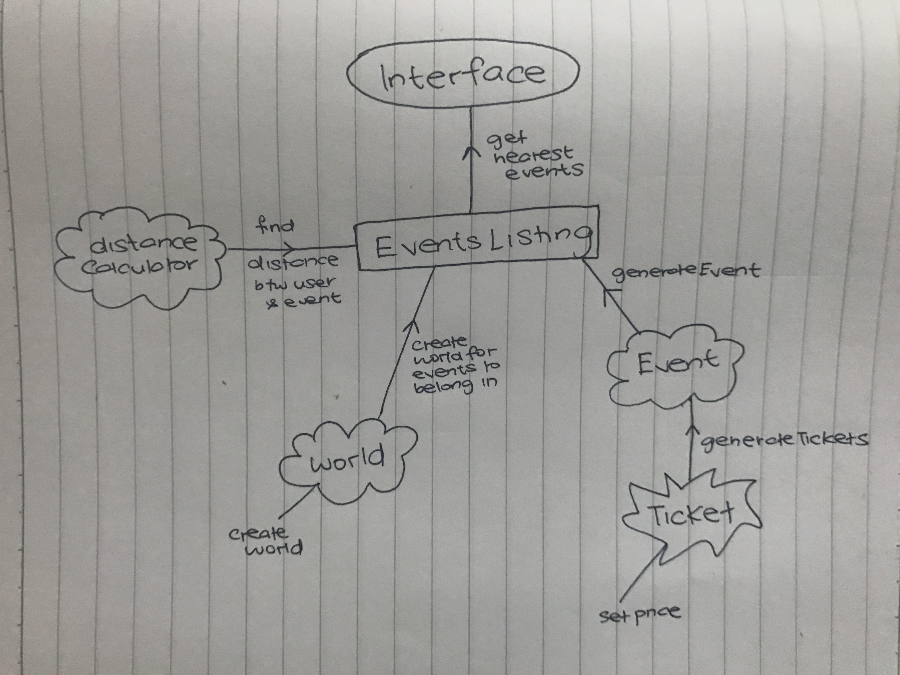
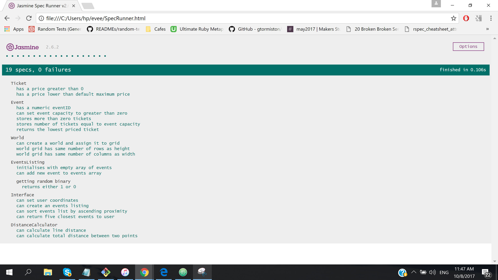

Event finder based on location coordinates.

## How To Run
```
1. Clone repository
2. Open index.html in your browser
3. Input coordinates and click Submit
```

## Technologies Used
* JavaScript
* Jasmine
* JQuery

## Screenshots


## My Approach
The first step was to plan the programme, brainstorm what the possible JS objects were going to be and how the objects would link together. My priorities for the project were to write clean and readable code and to meet the basic requirements set out in the instructions.



I wanted to ensure that there was a separation of concerns so that each object should only be responsible for one thing. Rather than start with a rigid list of pre-planned objects, I found that starting with a large (but functional) chunk of code initially and then extracting out methods wherever I believed it belonged to another object was more effective. I ended up with the following:

|Object Name |Responsibility |
|-----------|-----------------|
| Ticket | Create ticket with random non-zero price. |
| Event | Creates new event with tickets. Includes method to find its cheapest ticket. |
| World | Grid map made out of 2-dimensional array. |
| EventsListing | Main function is to generate list of all events including events' distance from user. |
| DistanceCalculator | Calculates Manhattan distance between two points. |
| Interface | Only part of programme user directly interacts with. Initialises a list of events and returns 5 nearest events to coordinates user inputs. |

I also followed a TDD-approach as much as possible across my codebase. If you'd like to run the tests, please open ```SpecRunner.html``` in your browser after cloning the directory to your server.



I decided to create a GUI-front end ~~because I like things to look pretty~~ to practice JQuery. Once I hit what I considered a minimum viable product overall, I went through a process of refactoring which included:

* Ensuring code was written in consistent and idiomatic JavaScript - adhered to the practices listed [here](https://github.com/rwaldron/idiomatic.js/).
* Renaming methods to increase clarity - made sure all function and variable  names were descriptive and more thoughtful.
* DRY - removed or refactored out any repetition.

**Some assumptions I made in the process:**

* Ticket price range for every event - minimum ticket price is ```0``` (CHEAP EVENTS FOR ALL). Maximum ticket price was set at ```100``` but can be changed by modifying the Ticket's ```DEFAULT_MAXIMUM_PRICE```.
* Different ticket prices - that it is perfectly normal for every ticket in one event to have a wildly variable price.
* Event capacity - the maximum number of tickets generated for each event is set at ```150```.
* Not all coordinates on the grid will have events - events are seeded into grid randomly.

## Questions

**Q: How might you change your program if you needed to support multiple events at the same location?**

The current 2-dimensional grid can be changed to a multidimensional one so that each co-ordinate/location would contain an array which can hold multiple events.

Currently, the ```generateEvents``` method within the ```EventsListing``` constructor is adding a new event to each coordinate based on the randomiser. This would be amended accordingly as well. Instead, we could iterate through the grid, and for each location, add an array with a randomised number of events (from 0 to max number of events per location).

[example code?]

**Q: How would you change your program if you were working with a much larger world size?**

The programme is already configured to be flexible in terms of changing world sizes. The ```height``` and ```width``` of your 'world' are accepted as arguments when creating a new Interface. Currently, the app is being initialised within ```jquery.js``` with these values set to 20 each (```new Interface( 20, 20)``` ) but this can be easily changed to whatever your heart desires.

## Reflection

This was a fun challenge overall - particularly with figuring out how to randomly generate seed data. The thing I struggled with the most was figuring out how the different objects were linking together, but with multiple diagrams and refactoring, this was achieved eventually.

The biggest takeaway from this was that sometimes your 'original plan' doesn't work the way you want and it is completely OK to re-visit and make some amendments. Initially, I had my event generation and listing within ```World``` but upon realising that all that wasn't really ```World```'s responsibility and that it was getting clunky FAST, I knew I had to change the interactions between my objects.

On reflection, there are a few things which I wonder if I could have done differently, namely the way in which I have generated events. I chose to iterate through each coordinate on the grid and then based on a random binary generator, would add an event if ```randomBinary === 1```.

Alternatively, I could have chosen something with less probability like generating random X and Y coordinates and adding an event if point is empty. This could have also prevented the clustering of eventIDs I had since new events would not be created in order of co-ordinates.

I've also left the event generation responsibility within the ```EventsListing``` constructor. This could possibly have been extracted to its own object as well.

## What's Next For Evee?
* More test coverage.
* Implement defensive programming so that errors are thrown if invalid coordinates are input or if no tickets/events are available. Alternatively,  the coordinate-input method could be altered so that users can only pick from a list rather than input their own values.
* Implement method to buy ticket which will remove the purchased ticket from ```Event```.
* Implement ability for user to add their own event by inputting coordinates, number of tickets and ticket price.
* More styling + design.
